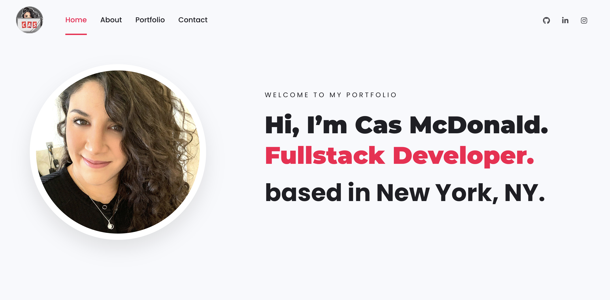
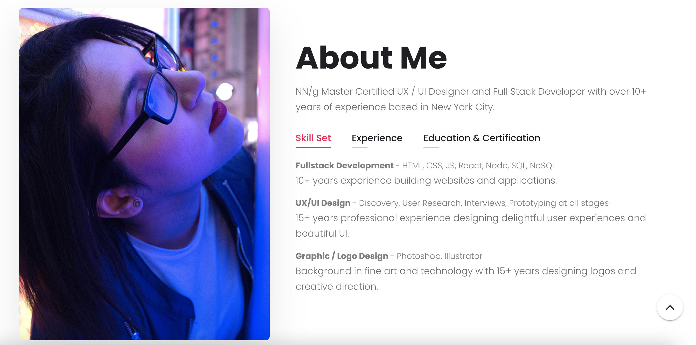
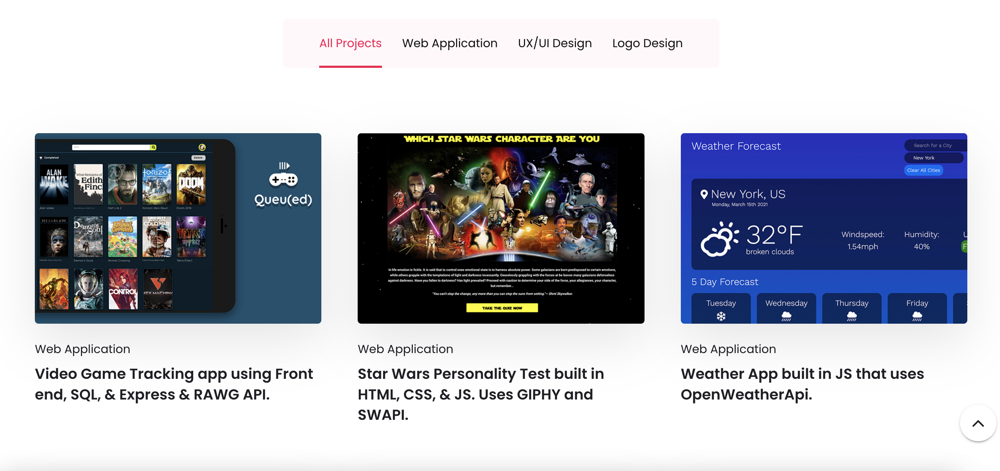

# Table of Contents:
* [Project Description](#Project)
* [Deployed Links](#Links)
* [Usage](#Usage)
* [Credits](#Credits)
* [License](#License)

# Project:
## Title:
# c18-react-portfolio

## Description:
New Portfolio in React JS.


#Links
## Deployed React Portfolio: ( I AM NOT PUTTING MY PHONE # ON THIS)
Coming soon

## Github:
https://github.com/Defy1x

## Linkedin:
https://www.linkedin.com/in/casmcdonald/

## Resume:
https://www.casctrl.com/assets/Casandra-McDonald-Resume.pdf

#Usage
## Final screenshot




## Requirements

```
* Submit an updated portfolio featuring Project 1 and two exemplary homework assignments.

* Submit an updated GitHub profile with pinned repositories featuring Project 1 and two exemplary assignments.

* Submit an updated resume

* Submit an updated LinkedIn profile
```

## Acceptance Criteria

```
Your updated portfolio should:

1. Display your full name, email, and phone number

2. Have links to your GitHub profile and LinkedIn profile

3. Have a link to a downloadable PDF of your resume

4. Display at least 2 examples of student work from either deployed projects or homeworks. For each project, make sure you have the following:

    * Project title

    * Link to the deployed version

    * Link to the GitHub repository

    * Screenshot of the deployed application

5. Have a polished, mobile-responsive user interface.

### Design

Unfortunately, this is where it gets a little bit subjective. Your site should look
"polished." Here are a few guidelines on what that means:

* Mobile-first design

* Choose a color palette for your site so it doesn't just look like
  the default bootstrap theme or an unstyled HTML site.

* Make sure the font size is large enough to read, and that the colors don't cause eye strain.

## Updated GitHub Profile

Employers (and potential collaborators) _will_ look at your GitHub profile, so put your best face forward.

Your GitHub profile must contain at least the following items:

1. Professional profile picture

   * A photo or an image other than the default Github identicon. (a semi-professional to professional photo or an avatar photo are preferred)

2. Biography

3. Your current location

4. Email address

5. Link to your deployed portfolio

6. At least 2 pinned repositories:

   * Navigate to [GitHub](https://github.com/) and go to your profile.

   * Click "Customize your pins"

   * Click the checkboxes for your project and 2-3 homework assignments that you would like to share

7. Follow a few of your classmates. They are the beginning of your professional network and being a developer is as much about being a part of the community as it is writing code.

8. README files. Every pinned project should contain a README file with:

   * Title of app
   * Live link to deployed app
   * List of technologies used
   * 1-2 sentences explaining what the app is
   * 2-3 Screenshots / gifs of the app
   * License (usually MIT)
   * Contact information for you and any collaborators

9. Commit history. Every pinned repository should have at least 20 commits.

### 3. Updated Resume

💁 Need help building a resume? Check out the [Career Services milestone resources](https://mycareerspot.org/resume).

Submit a clear, concise, and compelling resume, tailored to the type of job you’re looking for.

Your resume should include:

* a heading with your name, phone number, professional email address, links to LinkedIn, portfolio and GitHub

* a technical skills section, with all programming languages and technologies listed

* 3 of your strongest projects/homework assignments with brief description, languages used, and URL

```

#Credits
Thank you to everyone in the Columbia Engineering Bootcamp.

#License
MIT License

Copyright (c) 2021 Casandra McDonald

Permission is hereby granted, free of charge, to any person obtaining a copy
of this software and associated documentation files (the "Software"), to deal
in the Software without restriction, including without limitation the rights
to use, copy, modify, merge, publish, distribute, sublicense, and/or sell
copies of the Software, and to permit persons to whom the Software is
furnished to do so, subject to the following conditions:

The above copyright notice and this permission notice shall be included in all
copies or substantial portions of the Software.

THE SOFTWARE IS PROVIDED "AS IS", WITHOUT WARRANTY OF ANY KIND, EXPRESS OR
IMPLIED, INCLUDING BUT NOT LIMITED TO THE WARRANTIES OF MERCHANTABILITY,
FITNESS FOR A PARTICULAR PURPOSE AND NONINFRINGEMENT. IN NO EVENT SHALL THE
AUTHORS OR COPYRIGHT HOLDERS BE LIABLE FOR ANY CLAIM, DAMAGES OR OTHER
LIABILITY, WHETHER IN AN ACTION OF CONTRACT, TORT OR OTHERWISE, ARISING FROM,
OUT OF OR IN CONNECTION WITH THE SOFTWARE OR THE USE OR OTHER DEALINGS IN THE
SOFTWARE.
